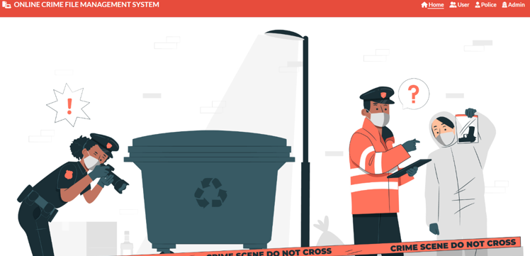
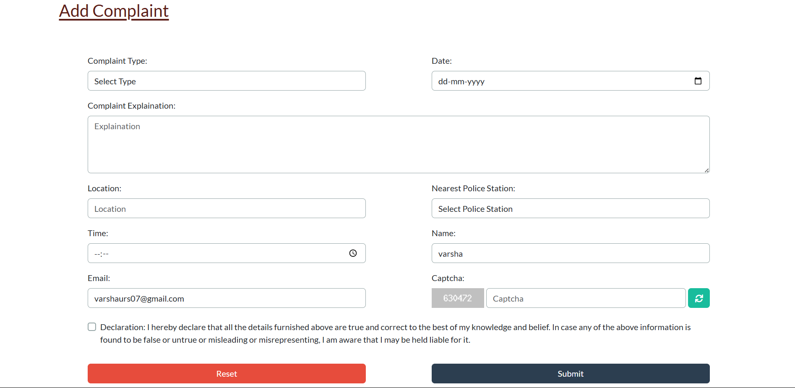
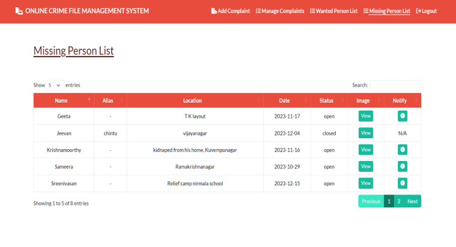
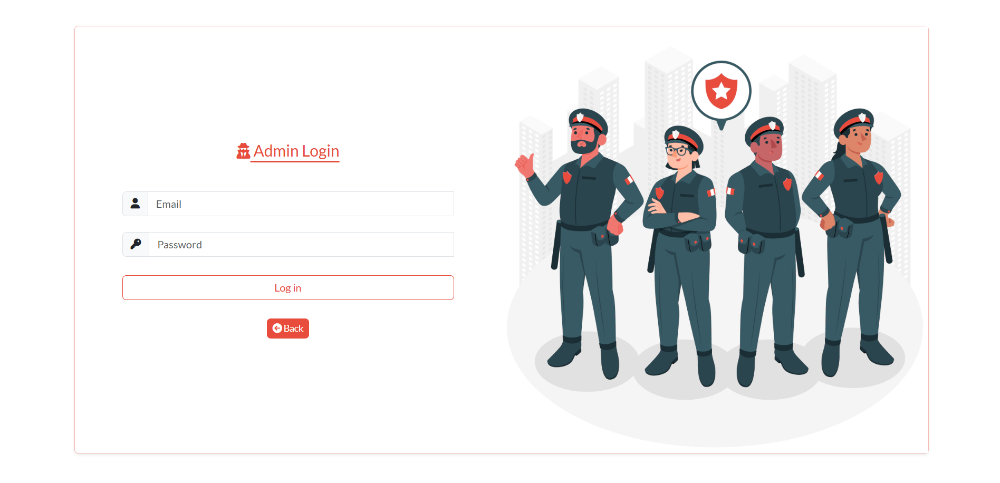
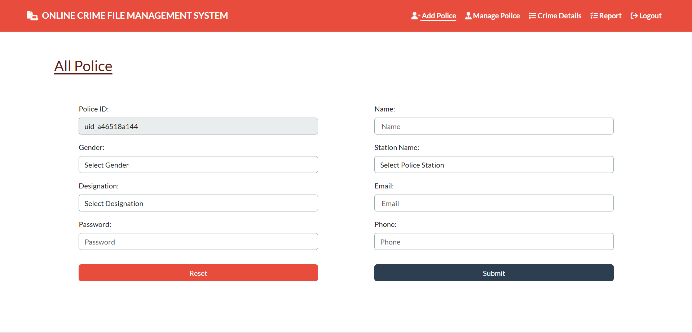
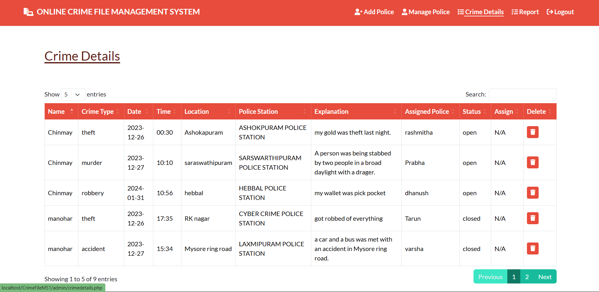
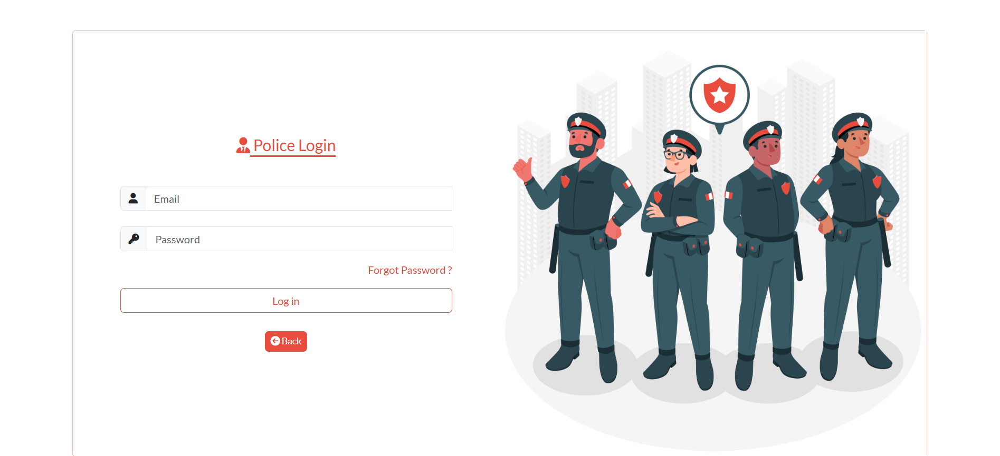
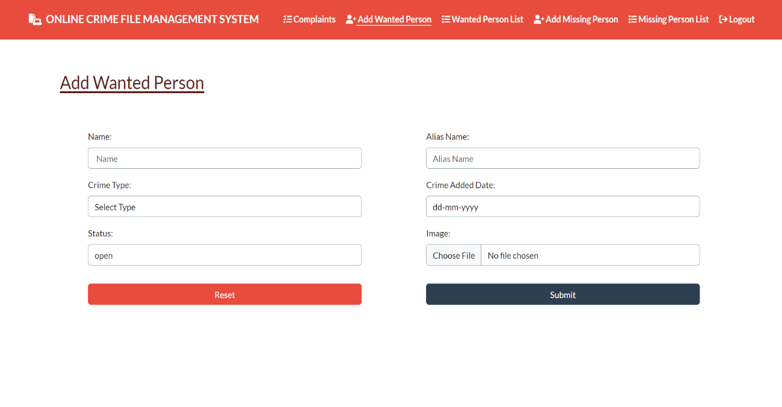
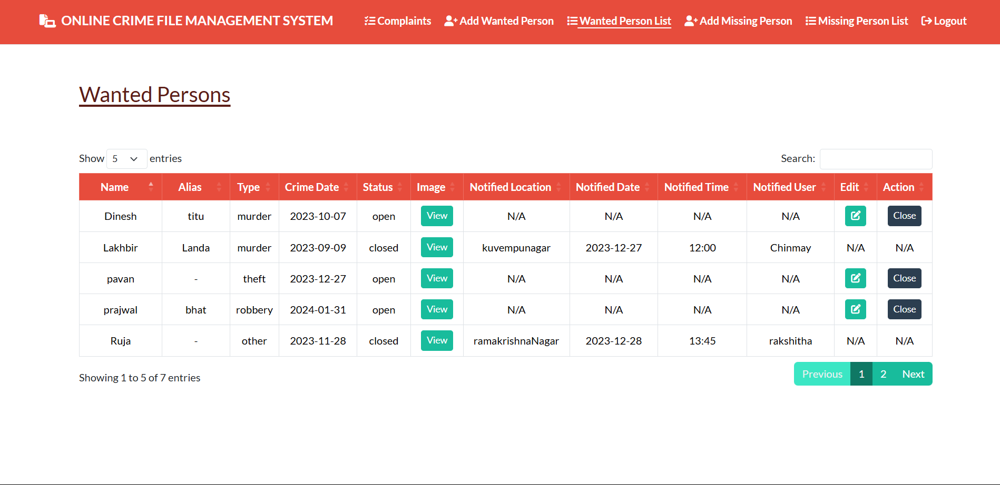

# Online-Crime-File-Management-System
This project is a web-based application developed to help citizens file complaints and allow police officials to manage and track crime cases efficiently. The system aims to digitize the traditional method of recording FIRs and tracking investigation statuses, thereby improving transparency and responsiveness in law enforcement.

## 📌 Key Features

👮 Role-based access: Admin, Police, and Citizen

📝 File complaints/FIRs online

🔍 Search and track complaint status

📁 Admin case assignment and updates

🔐 Secure login for all users

## 🛠️ Tech Stack

Frontend: HTML, CSS, JavaScript

Backend: Java (Servlets/JSP) or PHP (mention whichever used)

Database: MySQL

Tools: Eclipse / VS Code / XAMPP / NetBeans (mention as applicable)

## 🎯 Objectives

Simplify the complaint registration process for the public

Enable real-time case tracking

Reduce paperwork and manual errors

Ensure transparency in crime management

## 🚀 Future Improvements

Email/SMS notifications for updates

Analytics dashboard for crime trends

Multilingual support for wider accessibility

## 📸 Project Screenshots

> The following are output screenshots from the **Online Crime File Management System**, located in the `assets/` folder.

### 🏠 Home Page

### 👤 User Registration Page

### 📝 Add Complaint Page

### 👤 Missing Person Report Page

### 🔐 Admin Login Page

### 👮 Add Police Officer Page

### 📊 Crime Details Page

### 👮 Police Login Page

### 📋 Add Wanted Person Page

### 📃 Wanted Person List Page

